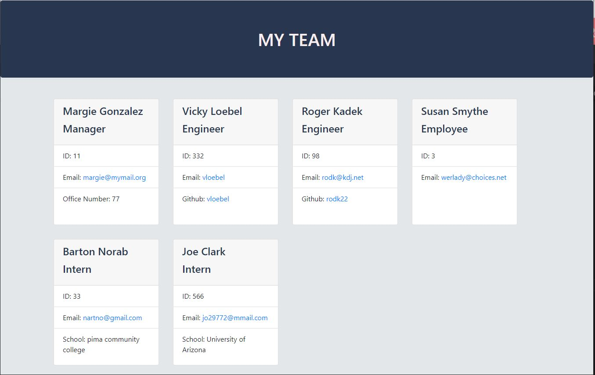

  
  # Team Builder
  ## Description  
  Team Builder is a command-line application that prompts for information about the manager, employees, engineers, and interns on a team and generates a web page containing the team roster.
  ## Table of Contents  
   * [Installation](#Installation)  
  * [Usage](#Usage)  
  * [Contributing](#Contributing)  
  * [Testing](#Testing) 
  * [Questions](#Questions)    
  * [License](#License)
  ## Installation  
  In addition to the applicaton files, this program requires node.js and inquirer for prompting user input.
  ## Usage  
  run with 'node index" from the command line where the js files and libraries are installed
 
  ## Testing  
  _tests_ folder contains an existing test package. Install "jest" in the program directory to run tests.
  ## Questions
  For more information, contact  
  * [vloebel on GitHub](https://github.com/vloebel)  
  * [vickyloebel](mailto:vickyloebel)

  
  ## License
  This software is distrubted without warranty under the MIT license agreement. To view terms and conditions, visit the [MIT License website](https://opensource.org/licenses/MIT).
      
